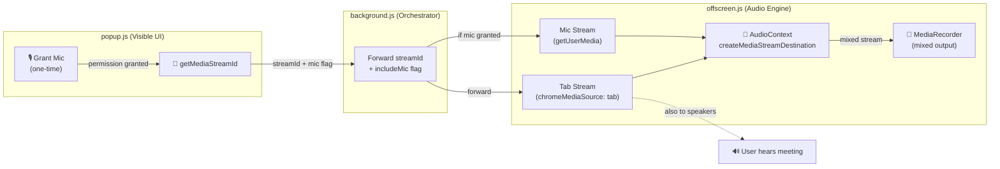

# 🎙️ Audio Mixing Implementation — Tab + Microphone

## The Problem
The extension was only recording the tab's audio (other participants), missing the Media Buyer's microphone entirely. Result: half the conversation was gone from the transcription.

## The MV3 Permission Challenge

> [!WARNING]
> Offscreen documents **cannot show browser permission prompts**. If the offscreen document calls `getUserMedia({ audio: true })` without prior permission, it silently fails.

**Solution:** The popup acts as the permission gateway. It requests mic access once (triggering the browser prompt), and after that the offscreen document can use `getUserMedia` silently.

## Architecture



## What Changed (4 files)

| File | Change |
|---|---|
| [manifest.json](file:///D:/Projects/TryGC_Meeting_Assistant/extension/manifest.json) | Version bump (no new permissions needed — MV3 doesn't have `audioCapture`) |
| [popup.html](file:///D:/Projects/TryGC_Meeting_Assistant/extension/popup.html) | Added mic permission banner with Grant button |
| [popup.js](file:///D:/Projects/TryGC_Meeting_Assistant/extension/popup.js) | Mic permission check on load + grant flow + `includeMic` flag forwarding |
| [offscreen.js](file:///D:/Projects/TryGC_Meeting_Assistant/extension/offscreen.js) | Full audio mixing pipeline with `createMediaStreamDestination()` |

## Audio Mixing Pipeline (offscreen.js)

The core of the fix is in `startRecording()`:

```
Tab Audio ──→ createMediaStreamSource() ──┬──→ mixedDestination ──→ MediaRecorder
                                          └──→ audioContext.destination (speakers)

Microphone ──→ createMediaStreamSource() ──→ mixedDestination ──→ MediaRecorder
               (echoCancellation: true)       (NOT to speakers — prevents feedback)
```

> [!IMPORTANT]
> The microphone is connected to the mixer **only**, not to speakers. This prevents audio feedback loops where the mic would pick up its own playback.

## How to Test

1. **Reload extension** in `chrome://extensions`
2. **Click extension icon** — you'll see the orange "🎙️ Microphone access required" banner
3. **Click "Grant"** — browser shows mic permission prompt → Allow
4. Banner turns green: "✓ Microphone access granted"
5. **Open Google Meet** → Click **"▶ Start Capture (Tab + Mic)"**
6. Speak into your mic while meeting audio plays
7. Click **"⏹ Stop & Download"**
8. Play the downloaded `.webm` — **both voices should be audible**

> [!TIP]
> If mic permission is denied, the extension gracefully falls back to tab-only recording. The user can still record, they just won't capture their own voice.

## Debugging

Check these console locations:
- **Service Worker** (`chrome://extensions` → Service Worker link): background.js logs
- **Offscreen document** (`chrome://inspect/#other` → look for offscreen.html): offscreen.js mixing logs
- **Popup** (right-click extension icon → Inspect Popup): popup.js permission logs
