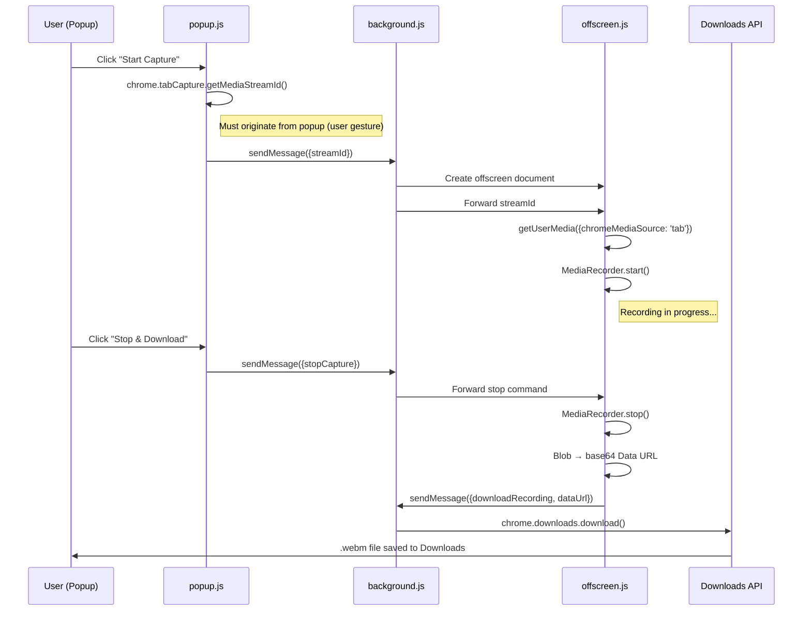

# 🤖 AI Meeting Assistant — Architecture & Walkthrough

## Bug Diagnosis

Your original `background.js` used **DOM APIs that don't exist in Manifest V3 service workers**:

| API Used | Available in MV3 Service Worker? | Fix |
|---|---|---|
| `MediaRecorder` | ❌ No | Moved to offscreen document |
| `AudioContext` | ❌ No | Moved to offscreen document |
| `Blob` | ❌ No | Moved to offscreen document |
| `URL.createObjectURL` | ❌ No | Replaced with base64 Data URL |
| `chrome.tabCapture.capture()` | ⚠️ Deprecated in MV3 | Replaced with `getMediaStreamId()` |

The reason you saw **no errors** is that MV3 service workers fail silently when they can't access undefined global objects — the code simply never executes.

## New Architecture



## Project Structure

```
AI_Meeting_Assistant/
├── extension/             # Manifest V3 Extension files
│   ├── manifest.json      # MV3 manifest with "offscreen" permission
│   ├── popup.html         # Dark-themed UI with timer
│   ├── popup.js           # User gesture → getMediaStreamId()
│   ├── background.js      # Orchestrator (no DOM APIs)
│   ├── offscreen.html     # Hidden document for DOM access
│   └── offscreen.js       # MediaRecorder + AudioContext
├── backend/
│   ├── .env.example       # API key template
│   ├── requirements.txt   # Python dependencies
│   ├── config.py          # Pydantic settings
│   ├── schemas.py         # Response models
│   ├── groq_service.py    # Whisper STT + Llama analysis
│   └── main.py            # FastAPI server
└── docs/                  # Project documentation
```

## How to Test the Extension

1. **Reload the extension** in `chrome://extensions` (toggle Developer Mode → "Load unpacked" → select the project folder)
2. **Open a Google Meet** (or any tab with audio)
3. **Click the extension icon** → Click **"▶ Start Capture"**
4. Let it record for a few seconds
5. Click **"⏹ Stop & Download"**
6. Check your **Downloads folder** for `Meeting_YYYY-MM-DDTHH-MM-SS.webm`

> [!TIP]
> To debug, open `chrome://extensions` → click "Service Worker" link to see background.js console logs. For offscreen.js logs, use `chrome://inspect/#other` and look for the offscreen document.

## How to Run the Backend

```bash
cd backend
pip install -r requirements.txt
cp .env.example .env
# Edit .env and add your GROQ_API_KEY

python main.py
# Server starts on http://localhost:8000
```

### Test with curl

```bash
curl -X POST http://localhost:8000/api/v1/analyze \
  -F "audio=@Meeting_2026-04-25T15-30-00.webm"
```

### API Response Schema

```json
{
  "transcript": "النص الكامل للاجتماع...",
  "summary": "ملخص موجز في 3-5 جمل",
  "action_items": [
    {
      "task": "تجهيز تقرير الحملة",
      "assignee": "أحمد",
      "deadline": "الأسبوع القادم",
      "priority": "high"
    }
  ],
  "campaign_budgets": [
    {
      "campaign_name": "حملة رمضان",
      "budget": "50,000 ريال",
      "platform": "Instagram",
      "notes": "تركيز على الـ Reels"
    }
  ],
  "key_decisions": ["اعتماد ميزانية حملة رمضان"],
  "duration_seconds": 1847.5,
  "language_detected": "ar"
}
```

## Next Step: n8n Integration

The `/api/v1/analyze` endpoint returns structured JSON that n8n can consume directly via an HTTP Request node. The webhook flow would be:

```
Extension → Backend API → n8n Webhook → ClickUp Tasks + Slack Summary
```

> [!IMPORTANT]
> For very long meetings (>25MB audio), you'll need to split the audio into chunks before sending to Groq. This can be added as a future enhancement using `pydub` or `ffmpeg`.
